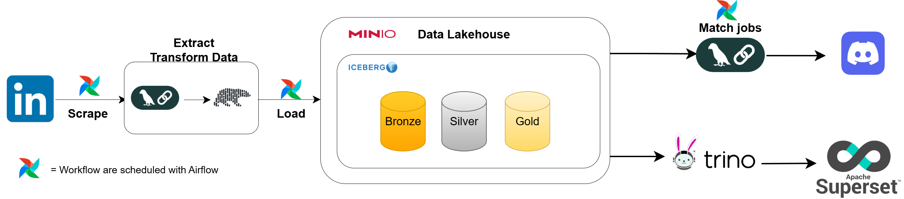
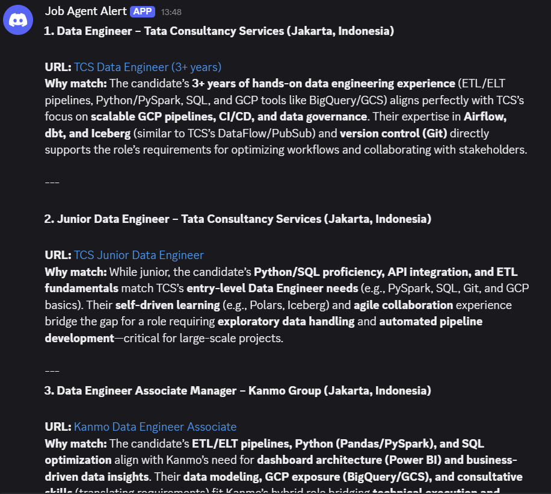

# ETL Datalakehouse for scrape job vacancy data with AI agents

## Overview
An ETL pipeline for scraping job vacancy data from linkedin jobs section using Beautifulsoup , Minio as data lake, Apache Iceberg as table format, polars for transformation, docker as the environment, Airflow as the workflow scheduler, Trino for query engine and Superset for dashboard. This project also utilizing Langchain for making AI agents that can extract data from unstructured job desc data and also match top 3 jobs from the processed data and send message to my own discord server. 

## Tools Used
- **Beautiful Soup**: Scraper for linkedin job post page 
- **Polars**        : Data processing and transformation, extract into json and parquet
- **Airflow**       : Pipeline orchestrator
- **LangChain**     : AI agents for extracting data and job matching
- **Ollama**        : Open source tools to run LLMs locally
- **Docker**        : Containerized airflow, ollama, minio, iceberg, trino and superset
- **Minio**         : Storing the extracted data
- **Iceberg**       : Create table format and Data transformation on Minio
- **Trino**         : Query engine to access Iceberg tables
- **Superset**      : Data exploration and visualization

## Architecture diagram

## Discord result

## Superset example dashboard

